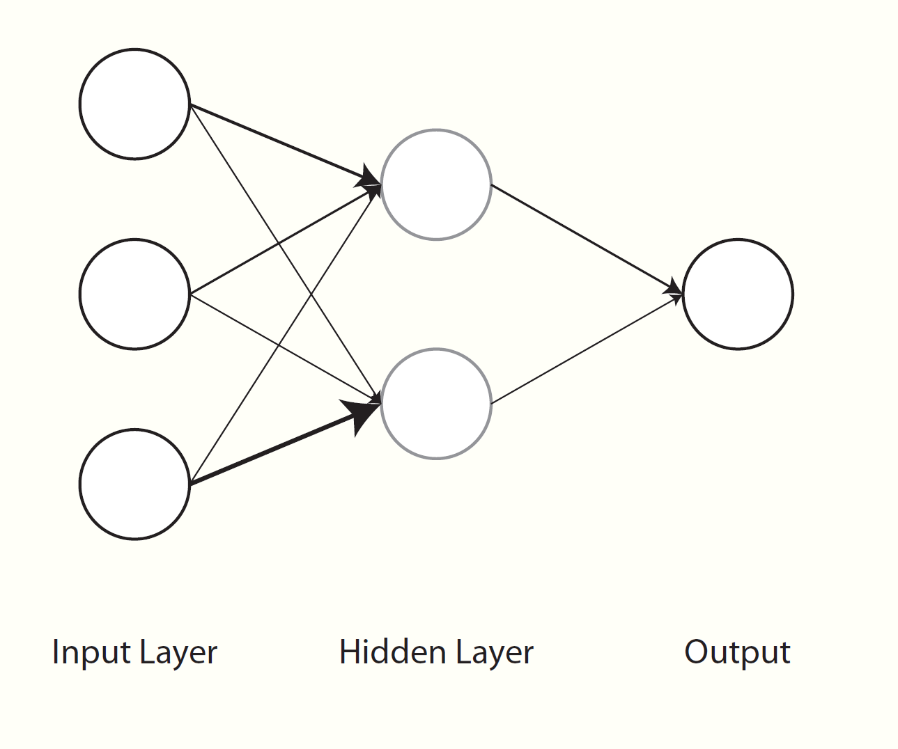

<style type="text/css">
.remark-slide-content {
    font-size: 30px;
    padding: 1em 4em 1em 4em;
}
</style>

```{r setup, include=FALSE}
knitr::opts_chunk$set(
  echo=T, 
  eval = F,
  message = F, 
  warning = F, 
  comment = NA,
  R.options=list(width=120), 
  cache.rebuild=F, 
  cache=T,
  fig.align='center', 
  fig.asp = .7,
  dev = 'svg', 
  dev.args=list(bg = 'transparent')
)

library(tidyverse); library(broom); library(kableExtra); library(visibly)

kable_df <- function(..., digits=3) {
  kable(..., digits=digits) %>% 
    kable_styling(full_width = F)
}

rnd = function(x, digits = 3) arm::fround(x, digits = digits)

demographics = read.csv('data/demos_anonymized.csv')
ids = read.csv('data/ids_anonymized.csv')
model_variables = read.csv('data/model_variables_anonymized.csv')
```


## Extensions to standard models

Nonlinear relationships
- Generalized Additive Models
- Nonlinear models (e.g. $y \sim a\cdot e^{b\cdot x}$)

Unsupervised methods
- Clustering/PCA etc.

---

## Extensions to standard models

Text Analysis
- Sentiment
- Tagging
- Topic modeling
- Word prediction

Penalized Regression
- Lasso, Ridge, Elasticnet


---

## Machine Learning

<span class="emph">Machine learning</span> is an **approach** to data analysis
- Focus is almost exclusively on prediction
- Performance is assessed on **new** data

Any method can be used for machine learning

Performance greater for ML, but interepretation, if even desired, can be more challenging

---

## Machine Learning

Standard methods

- Penalized regression (a starting point)
- Random forests and boosted trees (e.g. XGBoost)
- Neural nets
- Large scale graphical modeling (e.g. networks)

Standard techniques

- Data pre-processing
- Parameter tuning
- Cross-validation
- Combining models

---

## Machine Learning

A hypothetical tree

This would obviously misclassify many


```{r hypotree, echo=FALSE, eval=F, cache=FALSE}
# for whatever reason, this ceases to display appropriate fontsize in github book; display png until issue is fixed.
library(DiagrammeR)
grViz('digraph tree {
graph [rankdir = TD  bgcolor="#fffff8"]

node [shape = rectangle, style=filled, fillcolor=white, color=gray, width=.75]

node [fontcolor=gray25 fontname=Roboto fixedsize=true fontsize=5]
X1 [width=.5, label = "age"]  
X2 [width=.5, label = "gender"]
Negative1 [label="libuser" shape=circle color="#ff5500" width=.5]; 
Negative2 [label="libuser" shape=circle color="#ff5500" width=.5]; 
Positive [label="non" shape=circle color="#00aaff" width=.5];

edge [color=gray50 arrowhead=dot]
X1 -> Negative1 [label = " < 50", fontcolor="gray50" fontsize=7.5 color="#ff5500"];
X1 -> X2 [label = " > 5ò0", fontcolor="gray50" fontsize=7.5];
X2 -> Negative2 [label = "Male", fontcolor="gray50" fontsize=7.5 color="#ff5500"];
X2 -> Positive [label = "Female", fontcolor="gray50" fontsize=7.5 color="#00aaff"];

}')
```


---

## Machine Learning

Popular R machine learning frameworks
- caret
- mlr

---

## Machine Learning

```{r preprocess}
library(caret)
set.seed(1234) # so that the indices will be the same when re-run
trainIndices = createDataPartition(model_variables$libuser, p=.8, list=F)

X_train = model_variables %>% 
  slice(trainIndices)

X_test = model_variables %>% 
  slice(-trainIndices)

```

---

## Machine Learning


```{r xgboost_setup, echo=-21, eval=FALSE}
library(xgboost)
modelLookup("xgbLinear")
modelLookup("xgbTree")

xgb_opts = expand.grid(eta=c(.3,.4),
                       max_depth=c(9, 12),
                       colsample_bytree=c(.6,.8),
                       subsample=c(.5,.75,1),
                       nrounds=100,   # 1000 would be more reasonable, but very time consuming
                       min_child_weight=1,
                       gamma=0)
cv_opts = trainControl(method='cv', number=10)

library(doParallel)
cl = makeCluster(7)
registerDoParallel(cl)

```


```{r xgboost}
set.seed(1234)
results_xgb = train(
  libuser ~ .,
  data = X_train,
  method = 'xgbTree',
  preProcess = c('center', 'scale'),
  trControl = cv_opts,
  tuneGrid = xgb_opts
)
stopCluster(cl)

results_xgb
save(results_xgb, file='data/results_xgb.RData')
preds_gb = predict(results_xgb, X_test)
confusionMatrix(preds_gb, X_test$libuser, positive='yes')
```

---

## Machine Learning

Caveats:

Machine learning will take time to do well
- Need a baseline as a comparison

Payoff may be minimal compared to well-done standard methods that can handle data complexities
- Simply getting a good result is not enough

Many approaches are actually not very good with big data out of the box


---

## Deep Learning

Neural nets form the basis of <span class="emph">deep learning</span>
- AI refers to specific applications of deep learning



---

## Deep Learning

With deep learning, there may be dozens of hidden layers with possibly hundreds of nodes and additional complexities

Typically requires GPU

Typically work best for a specific task with consistent data type


Common frameworks include <span class="pack">tensorflow</span>, <span class="pack">pytorch</span>, etc.

Common wrappers include <span class="pack">keras</span>, <span class="pack">fastai</span>, <span class="pack">scikit-learn</span>, etc.

---

## Network Analysis

---


